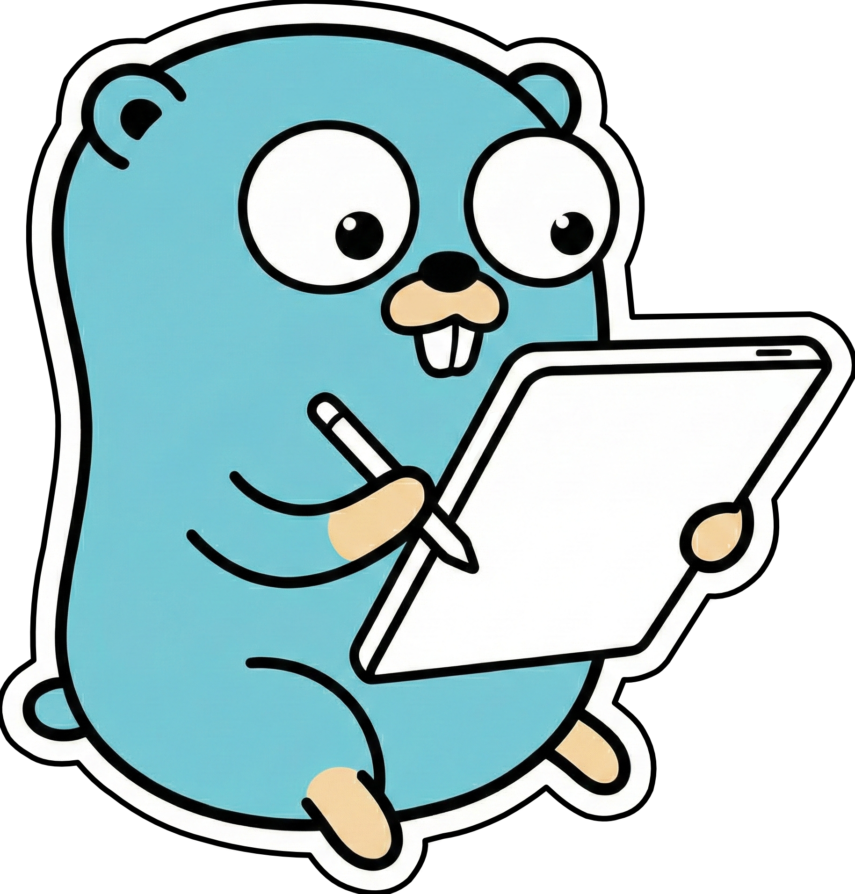

<p align="center">
  
  <h1 align="center">GoSNare</h1>
  <p align="center">
    <strong>A lightweight CLI tool that automatically mirrors <a href="https://supernote.com">Ratta Supernote</a> library into vectorized PDFs.</strong>
    <br />
    <br />
    <a href="https://github.com/alefaraci/GoSNare/releases">
      
    </a>
    <a href="https://go.dev">
      
    </a>
    <a href="https://github.com/alefaraci/GoSNare/blob/main/LICENSE">
      
    </a>
    <br />
    <a href="#about">About</a>
    ·
    <a href="#demo">Demo</a>
    ·
    <a href="#installation">Installation</a>
    ·
    <a href="#usage">Usage</a>
    ·
    <a href="#configuration">Configuration</a>
    ·
    <a href="#linux-server-deployment">NAS/Server Deployment</a>
    ·
    <a href="#contributing">Contributing</a>
    <br />
    [ <a href="">Download</a> ]
  </p>
</p>

## About

**GoSNare** is a CLI tool written in [Go](https://go.dev) designed to **automatically mirror your Supernote library** in a universally and accessible format, ready to print. 

It renders `.note` files as vector PDFs, bypassing the manual export from your device or the raster-only export limitation of the official app, and stamps `.mark` files onto their companion PDFs with vectorized handwritten notes, preserving highlights as editable PDF annotations.

**GoSNare** functions in two distinct modes:

- **Watch mode (daemon)** — Ideally suited for a NAS or server. Monitors [**Supernote Private Cloud**](https://supernote.com/blogs/supernote-blog/private-cloud-for-data-sovereignty-serverlink-for-remote-files-control-via-webdav?srsltid=AfmBOorWFigTf3vQ5xlLTZzHKtWRAfGrhyjzIy4PN0CfpOyT9hFq842B) and/or [**NetVirtualDisk**](https://supernote.com/blogs/supernote-blog/private-cloud-for-data-sovereignty-serverlink-for-remote-files-control-via-webdav?srsltid=AfmBOorWFigTf3vQ5xlLTZzHKtWRAfGrhyjzIy4PN0CfpOyT9hFq842B) (**WebDAV mounts**) and silently converts new or updated files to PDF the moment they sync.
- **Standalone CLI converter** — Manually converting individual files or batch-processing specific directories.

## Demo


```txt
Input Directories                       🔂              Output Directory
-----------------                                       ----------------
                                                        Note
Supernote Private Cloud (local)/                        ├── Note - 1.pdf
├── Note                                                └── Folder
│   ├── Note - 1.note                                   │   ├── Note - 2.pdf
│   └── Folder                                          │   └── Note - 3.pdf
│       ├── Note - 2.note                               :
│       └── Note - 3.note                               :
│   :                                                   
│   :                                                   Documents
└── Documents                                           ├── File - 1.pdf
    ├── File - 1.pdf                                    :
    └── File - 1.pdf.mark                               :
    :                                                   
    :                                                   Note - 5.pdf
                                                        File - 2.pdf
                                                        
NetVirtualDisk (WebDav)/                                
├── Note - 5.note
├── File - 2.pdf
└── File - 2.pdf.mark
    :
    :
```

### Key Features

| Feature | Description |
|---------|-------------|
| **Vector PDF Output** | Notes are rendered as crisp vector PDFs — not raster images |
| **No Manual Export** | Converts automatically; no tapping "Export" on the device |
| **NAS/Server Ready** | Runs as a systemd daemon at boot alongside Supernote Private Cloud |
| **Automatic Sync** | Watches directories and converts files on-the-fly |
| **Output Cleanup** | Automatically removes output PDFs when source files are deleted |
| **Incremental Conversion** | Skips files when output PDF is already newer than source |
| **Parallel Processing** | Batch conversions run concurrently using all available CPU cores |
| **Internal Links Preserved** | Links between pages work as native Supernote actions |
| **Native PDF Annotations** | Highlights and underlines from `.mark` files are preserved |
| **Customizable Colors** | Configure pen, marker colors via `TOML` config |
| **Cross-Platform** | Works on macOS, Linux, and Windows (*Not tested*)|
| **Searchable PDFs** (only macOS) | macOS Preview's Live Text can index handwriting |

### Supported Devices

- Supernote Manta (A5X2) ~ (*Tested on Chauvet 3.26.40*)
- Supernote Nomad (A6X2) ~ (*Not tested*)


## Installation

### Pre-built Binaries (recommended)

Quickly download the latest release of `GoSNare` for your platform from the [Releases](https://github.com/alefaraci/GoSNare/releases) page.

### Build from Source

> [!IMPORTANT]
> Building `GoSNare` from source requires [`Go`](https://go.dev/doc/install) to be installed on your machine.

```bash
# Clone the repository
git clone https://github.com/alefaraci/GoSNare.git
cd GoSNare

# Build
go build -o gosnare .
```

## Usage

### Watch Mode (Daemon)

```bash
# Watch directories from config and auto-convert on changes
gosnare --watch [--no-bg] [--config config.toml]

# On startup, removes orphaned output PDFs and converts stale files.
# Automatically retries .mark files when their companion PDF arrives later.
```

### Directory Batch Conversion

```bash
# Mirror directory structure, skip up-to-date files
gosnare --input ./notes/ --output ./pdfs/ [--no-bg] [--config config.toml]
```

### Single File Conversion

```bash
# Convert a .note file to PDF
gosnare -i notebook.note -o notebook.pdf [--no-bg] [--config config.toml]

# Convert mark file (stamps annotations onto companion PDF)
gosnare -i file.pdf.mark -o annotated.pdf [--no-bg] [--config config.toml]

# -i/--input and -o/--output are interchangeable
```

> [!IMPORTANT]
> On macOS, if you see a message that the app cannot be opened because it is from an unidentified developer, follow these steps:
>
> 1. Open `System Preferences` > `Security & Privacy Settings`;
> 2. Look towards the bottom of the window for a message saying: *"GoSNare was blocked from use because it is not from an identified developer."*;
> 3. A confirmation dialog will appear when you run again `gosnare` — click `Open` to confirm.

## Configuration

Create an optional `config.toml` file to customize colors, opacity, and watch paths. All fields are optional — missing values use sensible defaults.

```toml
[note]
black     = "#000000"
dark_gray = "#9D9D9D"
light_gray = "#C9C9C9"
white     = "#FFFFFF"

[mark]
black     = "#000000"
dark_gray = "#9D9D9D"
light_gray = "#C9C9C9"
white     = "#FFFFFF"
marker_opacity = 0.38

[watch]
supernote_private_cloud = "/path/to/supernote/cloud"
webdav = "/path/to/webdav/mount"
location = "/path/to/output"           # Required for --watch
poll_interval = 5                      # Seconds; for network filesystems
```

## Linux Server Deployment

### Download Pre-built Binaries and Copy it to the Server

Get the latest release of `GoSNare` for your platform from the [Releases](https://github.com/alefaraci/GoSNare/releases) page.

```bash
scp gosnare-linux your-user@your-server:/usr/local/bin/gosnare # or /bin/gosnare
```

### On the server

```bash
# Create the directories
sudo mkdir -p /etc/gosnare
sudo mkdir -p /var/lib/gosnare

# Create the config.toml file
touch /etc/gosnare/config.toml

# Make sure the user can access your input/output directories from config.toml
sudo chown -R your-user:your-group /path/to/input /path/to/output
# Give ownership to your service user/group
sudo chown your-user:your-group /var/lib/gosnare
sudo chmod 700 /var/lib/gosnare

# Create the systemd unit file
touch /etc/systemd/system/gosnare.service
```

```service
# Example `gosnare.service`

[Unit]
Description=GoSNare daemon
After=network.target

[Service]
Type=simple
ExecStart=/usr/local/bin/gosnare --no-bg --watch --config /etc/gosnare/config.toml
Restart=on-failure
RestartSec=5

# Run as a dedicated user for isolation (optional)
User=your-user
Group=your-group

# Force pdfcpu to write its config to /var/lib/gosnare
Environment="XDG_CONFIG_HOME=/var/lib/gosnare"

# Logging goes to journald automatically
StandardOutput=journal
StandardError=journal
SyslogIdentifier=gosnare

[Install]
WantedBy=multi-user.target
```

### Enable and start

```bash
sudo systemctl daemon-reload
sudo systemctl enable gosnare   # start at boot
sudo systemctl start gosnare    # start now
```

### Check status and logs

```bash
sudo systemctl status gosnare
sudo journalctl -u gosnare -f   # live logs
```

## Contributing

Contributions are welcome! Please feel free to submit a Pull Request.

#### Project Structure

| File | Purpose |
|------|---------|
| `main.go` | CLI parsing, single-file and directory processing |
| `config.go` | TOML config loading, hex color parsing, defaults |
| `notebook.go` | .note/.mark binary format parsing (metadata, pages, layers, links) |
| `rle.go` | RATTA_RLE decompression, palette-based color mapping |
| `pdf.go` | Layer compositing, zlib compression, PDF generation with link annotations |
| `mark.go` | Mark layer rendering, highlight/underline annotations via pdfcpu |
| `vector.go` | Vector PDF conversion for `.note` files, `pdfWriter`/`pdfObject` helpers |
| `watcher.go` | Watch/daemon mode with fsnotify + polling fallback |

#### Dependencies

| Dependency | Purpose |
|------------|---------|
| [gotrace](https://github.com/dennwc/gotrace) | Potrace bindings for bitmap-to-vector tracing |
| [pdfcpu](https://github.com/pdfcpu/pdfcpu) | PDF overlay for `.mark` file conversion |
| [toml](https://github.com/BurntSushi/toml) | TOML configuration file parsing |
| [fsnotify](https://github.com/fsnotify/fsnotify) | Filesystem event notifications for watch mode |

## Roadmap

- [x] Configurable color palette
- [x] Vector PDF export
- [x] Internal hyperlink preservation
- [ ] Tags as PDF bookmarks
- [ ] Headings as PDF table of contents (ToC)

## Acknowledgements

Credits: [supernote-tool](https://github.com/rjw57/supernote-tool) and [supernote_pdf](https://github.com/RohanGautam/supernote_pdf) for reverse-engineering the Supernote formats.

## License

This project is licensed under the Apache License 2.0 - see the [LICENSE](LICENSE) file for details.
